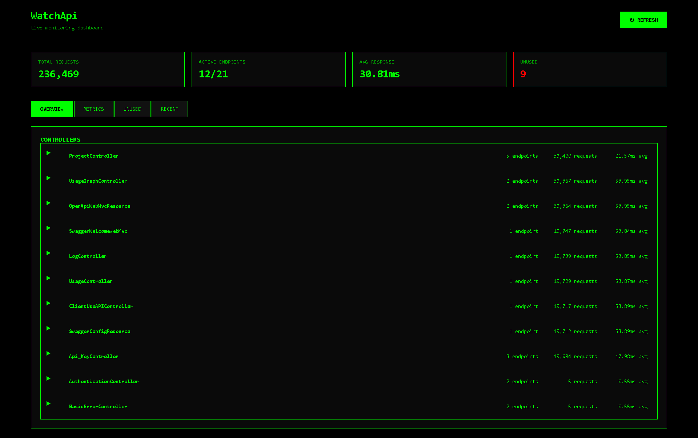
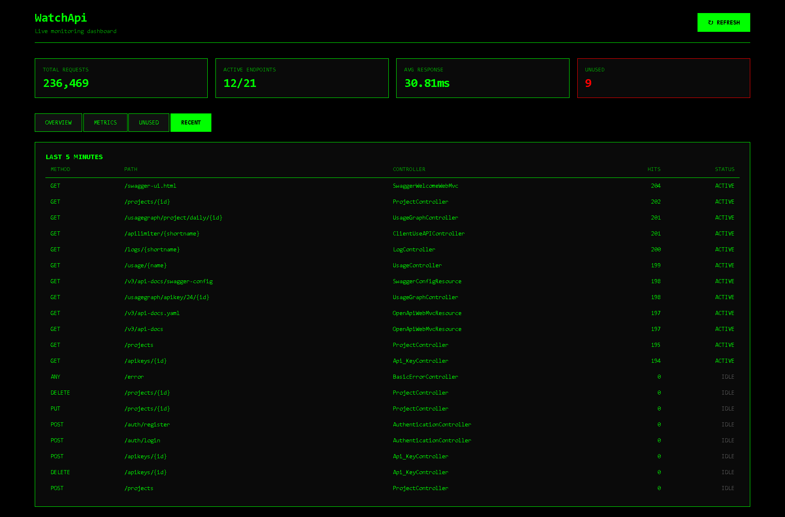
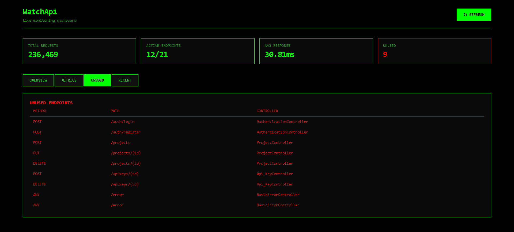
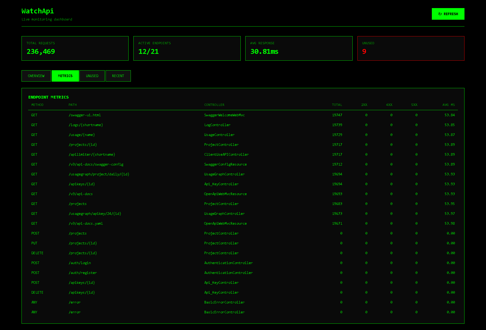

# WatchApi (Endpoint Monitor Dashboard)

A real-time monitoring dashboard for tracking Spring Boot application endpoints with metrics visualization, built with React and a custom backend API.


## 🎯 Features

- **Real-time Endpoint Monitoring** - Track all REST endpoints in your Spring Boot application
- **Metrics Dashboard** - View request counts, response times, and status codes (2xx, 4xx, 5xx)
- **Controller Grouping** - Organized view of endpoints grouped by controller
- **Unused Endpoint Detection** - Identify endpoints that haven't received any traffic
- **Recent Activity Tracking** - Monitor endpoints hit in the last 5 minutes
- **Terminal UI Theme** - Retro hacker-style green-on-black interface
- **Auto-refresh** - Keep your metrics up-to-date with manual refresh capability

## 📸 Screenshots

### Overview Tab


### Metrics Tab


### Unused Tab


### Recent Tab



## 🏗️ Architecture

### Frontend
```
src/
├── components/
    ├── EndpointDashboard.jsx     # Main container component
    ├── Header.jsx                # Dashboard header with refresh
    ├── StatsGrid.jsx             # Statistics cards grid
    ├── StatCard.jsx              # Individual stat card
    ├── TabNavigation.jsx         # Tab switching UI
    ├── TabContent.jsx            # Tab content router
    └── tabs/
    │   ├── OverviewTab.jsx       # Controller-grouped view
    │   ├── ControllerRow.jsx     # Collapsible controller row
    │   ├── EndpointTable.jsx     # Reusable endpoint table
    │   ├── MetricsTab.jsx        # All endpoints metrics
    │   ├── UnusedTab.jsx         # Unused endpoints list
    │   └── RecentTab.jsx         # Recent activity (5 min)
    └──services/
          └── api.js                    # API client for backend
          └── statsCalculator.js        # Stats calculation utilities
```

### Backend
The backend exposes these endpoints via a Spring Boot application:

**Base URL:** `http://localhost:9090/watche`

#### Endpoints:
- `GET /metrics?actuatorUrl={url}` - Get all endpoint metrics
- `GET /unused?actuatorUrl={url}` - Get unused endpoints
- `GET /lastmins` - Get endpoints hit in last 5 minutes

**Actuator URL Parameter:** Points to your Spring Boot application's actuator endpoint
- Example: `http://localhost:8080/actuator`

## 🚀 Getting Started

### Prerequisites

- **Node.js** 16.x or higher
- **npm** or **yarn**
- **Java** 17 or higher (for backend)
- **Maven** or **Gradle** (for backend)

### Frontend Setup

1. **Clone the repository**
   ```bash
   git clone https://github.com/yourusername/endpoint-monitor-dashboard.git
   cd endpoint-monitor-dashboard/frontend
   ```

2. **Install dependencies**
   ```bash
   npm install
   ```

3. **Configure API endpoint**
   
   Edit `src/services/api.js` and update the API base URL:
   ```javascript
   const API_BASE = 'http://localhost:9090/watche'; // Change if needed
   ```

4. **Start the development server**
   ```bash
   npm start
   ```

5. **Open the app**
   
   Navigate to `http://localhost:3000` in your browser

### Backend Setup

1. **Navigate to backend directory**
   ```bash
   cd backend
   ```

2. **Configure application**
   
   Update `application.properties` or `application.yml`:
   ```properties
   server.port=9090
   # Add any other backend configurations
   ```

3. **Build the application**
   
   Using Maven:
   ```bash
   mvn clean install
   ```
   
   Using Gradle:
   ```bash
   gradle build
   ```

4. **Run the application**
   
   Using Maven:
   ```bash
   mvn spring-boot:run
   ```
   
   Using Gradle:
   ```bash
   gradle bootRun
   ```

5. **Verify backend is running**
   
   Visit: `http://localhost:9090/watche/metrics?actuatorUrl=http://localhost:8080/actuator`

### Target Application Setup

Your monitored Spring Boot application needs Spring Boot Actuator enabled:

1. **Add dependency** (Maven):
   ```xml
   <dependency>
       <groupId>org.springframework.boot</groupId>
       <artifactId>spring-boot-starter-actuator</artifactId>
   </dependency>
   ```

2. **Configure actuator** in `application.properties`:
   ```properties
   management.endpoints.web.exposure.include=*
   management.endpoint.health.show-details=always
   ```

3. **Start your application** on port 8080 (or update the actuatorUrl parameter)

## 🔧 Configuration

### API Base URL
Update in `src/services/api.js`:
```javascript
const API_BASE = 'http://your-backend-url:port/watche';
```

### Actuator URL
The default actuator URL is `http://localhost:8080/actuator`. If your application runs on a different port or path, you'll need to update the fetch calls in `api.js`:

```javascript
fetch(`${API_BASE}/metrics?actuatorUrl=http://your-app:port/actuator`)
```

## 🐛 Known Issues

- Tables may not be responsive on very small screens (<480px)
- Large number of endpoints (>1000) may cause performance issues
- Not Every Info is supposed to be accurate 
